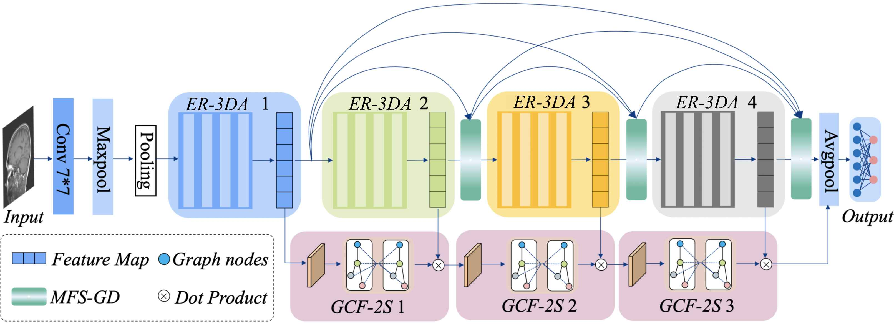

# Efficient Brain Tumor Diagnosis Networks by Fusing Tensor Residual Attention and Superpixel Map Features

[](https://pytorch.org/)
[](https://www.python.org/)

PyTorch implementation of **BTNet-TS**, a novel architecture designed to achieve an optimal balance between accuracy and efficiency in brain MRI tumor diagnosis.

## Overview



Brain tumors present a significant threat to human life and health. Current deep learning models for brain MRI diagnosis often struggle with insufficient feature representation and limited balancing capabilities, impairing diagnostic accuracy, especially in clinical scenarios with severe class imbalance.

To address these issues, we propose the **BTNet-TS** architecture, which consists of three core components:

1. **ER-3DA (Efficient Residual blocks fused with 3-dimensional tensor attention):** Utilizes 3D tensors to capture concurrent multidimensional semantic features of brain MRI lesions without unnecessary computational bloat.
2. **MFS-GD (Multi-scale Feature Fusion Strategy based on Group DenseNet):** Fuses underlying fine-grained features with deep semantic information, inherently mitigating extreme class imbalance by preserving minority lesion details.
3. **GCF-2S (Graph Convolutional Feature extraction based on Superpixel Segmentation):** Extracts and analyzes lesion-local correlation features to provide complementary topological priors.

**Key Results:**  (5-fold)

| Dataset | Accuracy | Notes |
|---------|----------|-------|
| BTD-4  | **98.28%** | 4-class brain tumor MRI |
| BTD-3  | **98.69%** | 3-class brain tumor MRI |
| BTD-44 | **96.03** | 44-class fine-grained  |

---

## Environment Setup

Our standardized experimental environment ensures exact reproducibility. The model was trained and evaluated on Ubuntu 20.04 using an NVIDIA RTX 4090 GPU.

**Prerequisites:**

- Python >= 3.8
- PyTorch == 2.1.0
- CUDA == 11.3+ (for GPU acceleration; MPS supported on Apple Silicon)

**Installation:**

```bash
git clone https://github.com/DL-Clas/Tumors_Clas.git
cd Tumors_Clas

conda create -n btnet python=3.8 -y
conda activate btnet

conda install pytorch==2.1.0 torchvision==0.16.0 torchaudio==2.1.0 cudatoolkit=11.3 -c pytorch
pip install -r requirements.txt
```

---

## Datasets & Data Split Protocols

To ensure complete transparency and prevent data leakage, we rigorously standardized our preprocessing and data splitting methodologies. Fold split files (`fold_1.txt` ... `fold_5.txt`) are provided under each dataset directory.

Please download the datasets from their public repositories or shared data links and place them in the `data/` folder:

### 1. BTD-4 — Brain Tumor MRI Dataset (4-class)

- **Source:** [Kaggle](https://www.kaggle.com/datasets/masoudnickparvar/brain-tumor-mri-dataset)
- **Details:** 7,023 aggregated human brain MRIs
- **Classes:** Glioma, Meningioma, Pituitary, Normal
- **Split:** 5-fold cross-validation, performed **image-wise with rigorous deduplication**
- **Processed:** [download](https://www.kaggle.com/datasets/cvlearning0616/btd-4-dataset)

### 2. BTD-3 — Brain Tumor Dataset (3-class)

- **Source:** [figshare](https://figshare.com/articles/dataset/brain_tumor_dataset/1512427)
- **Details:** 3,064 contrast-enhanced T1 images across 233 patients
- **Classes:** Glioma, Meningioma, Pituitary
- **Split:** 5-fold cross-validation, performed **strictly at the patient level** to prevent near-duplicate slice leakage
- **Processed:** [download](https://www.kaggle.com/datasets/cvlearning0616/btd-3-dataset)


### 3. BTD-44 — Brain Tumor MRI Images 44 Classes

- **Source:** [Kaggle](https://www.kaggle.com/datasets/fernando2rad/brain-tumor-mri-images-44c)
- **Details:** 4,479 highly imbalanced brain tumor images across 44 fine-grained sub-categories
- **Split:** 5-fold cross-validation, performed **image-wise with rigorous deduplication**
- **Processed:** [download](https://www.kaggle.com/datasets/cvlearning0616/btd-44-dataset)

### Image Deduplication

To eliminate near-duplicate slices that could cause data leakage, use the provided deduplication utility:

```bash
python "data/image deduplication.py"
```

The script performs global pHash-based deduplication with configurable Hamming distance threshold. Duplicate images are moved to an archive folder (not deleted) for manual verification.

---

## Training

All models are trained under a strictly matched protocol with standardized normalization, identical augmentation (random resized crop + horizontal flip), and a fixed global random seed (Seed = 42) for exact replication. Xavier Uniform initialization is applied to all convolution and linear layers.

```bash
python train.py \
    --data_root ./data/BTD-44 \
    --weights_dir ./weights \
    --batch_size 16 \
    --epochs 15 \
    --lr 1e-3 \
    --min_lr 1e-5 \
    --k_folds 5
```

**Arguments:**

| Argument | Default | Description |
|----------|---------|-------------|
| `--data_root` | `./data/BTD-44` | Root directory of the dataset (must contain `fold_*.txt` and `class_mapping.txt`) |
| `--weights_dir` | `./weights` | Directory to save model weights |
| `--batch_size` | 16 | Training batch size |
| `--epochs` | 15 | Maximum number of epochs per fold |
| `--lr` | 1e-3 | Initial learning rate (Adam optimizer) |
| `--min_lr` | 1e-5 | Minimum learning rate for cosine annealing scheduler |
| `--k_folds` | 5 | Number of cross-validation folds |

**Training details:**

- **Optimizer:** Adam
- **Scheduler:** Cosine annealing (`T_max = epochs`, `eta_min = min_lr`)
- **Early stopping:** Patience = 10 epochs (monitors validation loss)
- **Model:** `MyDiag21` (auto-detected from `net/MyDiagX.py`)
- **Output:** Weights saved as `weights/MyDiag21/Fold{1..5}_Best.pth`

To train on a different dataset, change `--data_root`:

```bash
python train.py --data_root ./data/BTD-4
python train.py --data_root ./data/BTD-3
```

---

## Testing and Evaluation

### Standard Evaluation (`test.py`)

Runs 5-fold evaluation with per-fold metrics (Accuracy, Precision, Recall, F1-Score), 95% confidence intervals, confusion matrices (raw + normalized), and patient-level bootstrap statistics (B=1000).

```bash
python test.py \
    --data_root ./data/BTD-44 \
    --weights_dir ./weights \
    --results_dir ./results \
    --batch_size 16 \
    --k_folds 5
```

**Arguments:**

| Argument | Default | Description |
|----------|---------|-------------|
| `--data_root` | `./data/BTD-44` | Root directory of the dataset |
| `--weights_dir` | `./weights` | Directory containing model weights |
| `--results_dir` | `./results` | Directory to save evaluation results |
| `--batch_size` | 16 | Evaluation batch size |
| `--k_folds` | 5 | Number of cross-validation folds |

**Outputs:**

- `results/MyDiag21/fold_level_raw_results.csv` — Per-fold metrics
- `results/MyDiag21/cm_raw.png` — Raw confusion matrix heatmap
- `results/MyDiag21/cm_normalized.png` — Normalized confusion matrix heatmap
- Console: Mean ± 95% CI for each metric, patient-level bootstrap accuracy & F1

### Evaluation with Confidence Scores (`test_prof.py`)

Same as `test.py` but additionally computes softmax confidence probabilities for each prediction. Results are cached to `results/predictions_with_conf.txt` for reuse.

```bash
python test_prof.py \
    --data_root ./data/BTD-44 \
    --weights_dir ./weights \
    --results_dir ./results
```

**Cache format** (`predictions_with_conf.txt`):

```
Fold_ID    True_Label    Pred_Label    Confidence    Image_Path
```

### Evaluation with Per-Sample Recording (`test_record.py`)

Same as `test.py` but caches all fold predictions (without confidence) to `results/predictions_B44_BT.txt` for downstream sensitivity analyses.

```bash
python test_record.py \
    --data_root ./data/BTD-44 \
    --weights_dir ./weights \
    --results_dir ./results
```

**Cache format** (`predictions_B44_BT.txt`):

```
Fold_ID    True_Label    Pred_Label    Image_Path
```

---

## Efficiency Evaluation

Profiles hardware efficiency metrics: parameter count, FLOPs/MACs, inference latency, throughput, and peak GPU memory.

```bash
python efficiency_eval.py
```

**Requires GPU** for accurate CUDA-event-based latency measurement. Outputs:

| Metric | Description |
|--------|-------------|
| Parameters | Total learnable parameters |
| MACs | Multiply-accumulate operations (via `thop`) |
| Inference Latency | Mean ± std ms/image (300 repetitions) |
| Throughput | Images/second (batch_size=1) |
| Peak GPU Memory | Max memory allocated during inference |

---

## MRI Perturbation Simulation

Simulates clinically realistic MRI perturbations to visualize and qualitatively assess model robustness.

```bash
python simulate.py
```

**Six perturbation types:**

1. **Intensity Nonuniformity** — Multiplicative B1 bias field simulating RF inhomogeneity
2. **Motion Artifacts** — Y-axis ghosting via phase-encoding direction phase shifts
3. **Scanner/Site Shifts** — Affine rotation (5°) + translation simulating patient positioning variation
4. **Resolution Changes** — K-space truncation retaining 18% of frequency information
5. **Skull-stripping Variation** — Asymmetric mask simulating algorithm over-cutting of cortex
6. **Modality Differences** — Nonlinear contrast inversion with feathered alpha blending (simulating T1↔T2 shift)

Outputs a 2×4 subplot figure comparing original vs. perturbed images with model predictions.

---

## Sensitivity Analyses

### Class-Prior Sensitivity (`sen_prior.py`)

Analyzes the relationship between class sample size (prior) and per-class recall. Produces a scatter plot with 95% CI regression fit.

```bash
python sen_prior.py
```

- **Input:** `results/predictions_B44_BT.txt`
- **Output:** `class_prior_sensitivity_BTD44.png`

### Rare-Class Confusion Analysis (`sen_rare.py`)

Automatically identifies the 8 rarest classes (by sample count) in BTD-44 and generates a confusion sub-matrix heatmap to analyze inter-class confusion patterns among underrepresented categories.

```bash
python sen_rare.py
```

- **Input:** `results/predictions_B44_BT.txt`
- **Output:** `rare_class_confusion_BTD44.png`

### Calibration & ECE Analysis (`sen_grop.py`)

Computes Expected Calibration Error (ECE) and plots reliability diagrams for the 5 majority and 5 minority classes. Evaluates whether model confidence scores are well-calibrated across class frequency groups.

```bash
python sen_grop.py
```

- **Input:** `results/predictions_with_conf.txt`
- **Output:** `reliability_diagrams_optimized.pdf` / `.png`

---

## Statistical Testing

Performs rigorous statistical significance testing of BTNet-TS against baseline models using three complementary methods:

1. **Bootstrap confidence intervals** (B=1000) for Accuracy, Precision, Recall, and Macro-F1
2. **Paired t-test** on 5-fold accuracies
3. **P-value formatting** per SCI journal standards (p < 0.001 reported in scientific notation)

```bash
python t-test.py
```

- **Input:** `results/predictions_B44_*.txt` (all model prediction files in the working directory)
- **Output:** Console table with Accuracy ± CI margin, Precision ± CI margin, Recall ± CI margin, Macro-F1 ± CI margin, and p-value per model

**Note:** The proposed model file must be named `predictions_B44_BT.txt`. All other `predictions_B44_*.txt` files are treated as baselines.

---

## Project Structure

```
Tumors_Clas/
├── net/
│   └── MyDiagX.py              # Core model (MyDiag21, ER-3DA, MFS-GD, GCF-2S)
├── data/
│   ├── BTD-3/                  # 3-class dataset
│   ├── BTD-4/                  # 4-class dataset
│   ├── BTD-44/                 # 44-class dataset
│   └── image deduplication.py  # pHash-based deduplication utility
├── weights/
│   ├── MyDiag21/               # Trained fold weights
│   └── weights.txt             # Download links for pretrained weights
├── results/
│   ├── arc.png                 # Architecture diagram
│   ├── cm_raw.png              # Raw confusion matrix
│   ├── cm_normalized.png       # Normalized confusion matrix
│   ├── fold_level_raw_results.csv
│   ├── predictions_B44_BT.txt       # Cached predictions
│   └── predictions_with_conf.txt    # Cached predictions with confidence
├── train.py                    # 5-fold CV training
├── test.py                     # Standard evaluation
├── test_prof.py                # Evaluation with confidence scores
├── test_record.py              # Evaluation with per-sample recording
├── efficiency_eval.py          # Hardware efficiency profiling
├── evaluate_robustness.py      # Noise/blur robustness evaluation
├── simulate.py                 # MRI perturbation simulation
├── sen_prior.py                # Class-prior sensitivity analysis
├── sen_rare.py                 # Rare-class confusion analysis
├── sen_grop.py                 # Calibration & ECE analysis
├── t-test.py                   # Statistical significance testing
├── requirements.txt
├── manuscript.pdf
└── README.md
```

## Contact

For any questions regarding the code, data splits, or methodology, please open an issue in this repository or contact the corresponding author.
