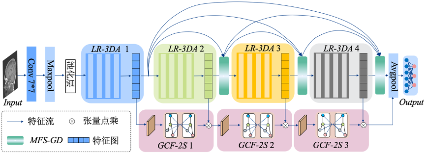

# BTNet-TS: Efficient Brain Tumor Diagnosis Networks by Fusing Tensor Residual Attention and Superpixel Map Features

[](https://pytorch.org/)

Official PyTorch implementation of **BTNet-TS**, a novel architecture designed to achieve an optimal balance between accuracy and efficiency in brain MRI tumor diagnosis.

## 📖 Overview

 

Brain tumors present a significant threat to human life and health. Current deep learning models for brain MRI diagnosis often struggle with insufficient feature representation and limited balancing capabilities, impairing diagnostic accuracy, especially in clinical scenarios with severe class imbalance. 

To address these issues, we propose the **BTNet-TS** architecture, which consists of three core components:
1. **ER-3DA (Efficient Residual blocks fused with 3-dimensional tensor attention):** Utilizes 3D tensors to capture concurrent multidimensional semantic features of brain MRI lesions without unnecessary computational bloat.
2. **MFS-GD (Multi-scale Feature Fusion Strategy based on Group DenseNet):** Fuses underlying fine-grained features with deep semantic information, inherently mitigating extreme class imbalance by preserving minority lesion details.
3. **GCF-2S (Graph Convolutional Feature extraction based on Superpixel Segmentation):** Extracts and analyzes lesion-local correlation features to provide complementary topological priors.

**Key Results:** BTNet-TS achieves a state-of-the-art accuracy of **98.28%** on the BTD-4 dataset. Comprehensive 5-fold cross-validation proves the model's robustness against patient and data variability, demonstrating a highly favorable accuracy-efficiency balance compared to both heavy vision transformers and compact CNNs.

---

## ⚙️ Environment Setup

Our standardized experimental environment ensures exact reproducibility. The model was trained and evaluated on Ubuntu 20.04 using an NVIDIA RTX 4090 GPU.

**Prerequisites:**
* Python >= 3.8
* PyTorch == 1.11.0
* CUDA == 11.3

**Installation:**
```bash
# Clone the repository
git clone [https://github.com/DL-Clas/Tumors_Clas.git](https://github.com/DL-Clas/Tumors_Clas.git)
cd Tumors_Clas

# Create a conda virtual environment
conda create -n btnet python=3.8 -y
conda activate btnet

# Install PyTorch and dependencies
conda install pytorch==1.11.0 torchvision==0.12.0 torchaudio==0.11.0 cudatoolkit=11.3 -c pytorch
pip install -r requirements.txt
```

---

## 📂 Datasets & Data Split Protocols

To ensure complete transparency and prevent data leakage, we rigorously standardized our preprocessing and data splitting methodologies. The exact dataset split files (JSON/CSV) are available in the `splits/` directory. 

Please download the datasets from their public repositories and place them in the `data/` folder:

1. **[BTD-3 (Brain Tumor Dataset)](https://figshare.com/articles/dataset/brain_tumor_dataset/1512427)**
   * **Details:** 3,064 contrast-enhanced T1 images across 233 patients.
   * **Split Granularity:** 8:2 split performed **strictly at the patient level** to prevent near-duplicate slice leakage.
   ```bash
   python split_data.py --dataset BTD-3 --val_rate 0.2 --split_mode patient
   ```
   
2. **[BTD-4 (Brain Tumor MRI Dataset)](https://www.kaggle.com/datasets/masoudnickparvar/brain-tumor-mri-dataset)**
   * **Details:** 7,023 aggregated human brain MRIs.
   * **Split Granularity:** 8:2 split performed **image-wise with rigorous deduplication** to ensure no near-overlap exists between training and testing sets.
   ```bash
   python split_data.py --dataset BTD-4 --val_rate 0.2 --split_mode image
   ```
   
3. **[BTD-44 (Brain Tumor MRI Images 44 Classes)](https://www.kaggle.com/datasets/fernando2rad/brain-tumor-mri-images-44c?select=Astrocitoma+T1)**
   * **Details:** 4,479 highly imbalanced brain tumor images across 44 fine-grained sub-categories.
   * **Split Granularity:** 8:2 split performed **image-wise with rigorous deduplication**.
   ```bash
   python split_data.py --dataset BTD-44 --val_rate 0.2 --split_mode image
   ```
---

## 🚀 Training

All baseline models and the BTNet-TS architecture are trained under a strictly matched protocol. This includes standardized normalization, identical augmentation operations (standard spatial transformations), and fixed global random seeds (Seed = 42) for exact replication.

**1. Standard Training**
To train the BTNet-TS model from scratch on the BTD-4 dataset using the default hyperparameters:

```bash
python train.py \
  --dataset BTD-4 \
  --data_dir ./data/BTD-4 \
  --batch_size 16 \
  --epochs 100 \
  --lr 0.001 \
  --seed 42 \
  --save_dir ./checkpoints
```

**2. Cross-Validation:** 
To run the rigorous 5-fold cross-validation used in the manuscript for robust clinical generalization evaluation:
```bash
python train_cv.py --dataset BTD-4 --folds 5
```

*Note: Detailed hyperparameters for the dynamic graph construction (where superpixel nodes K are set to 16, 9, and 4 for GCN1, GCN2, and GCN3) are implemented inherently within the `net/BTNet_TS.py` architecture.*

---

## 🧪 Testing and Evaluation

**1. Comprehensive Diagnostic Performance**
To test a pre-trained BTNet-TS model and generate comprehensive classification metrics including Accuracy, Macro Precision, Macro Recall, Macro F1-Score, MCC, Balanced Accuracy, and Per-Class Sensitivity:

```bash
python test.py \
  --dataset BTD-44 \
  --data_dir ./data/BTD-44/test \
  --weights ./checkpoints/best_btnet_model.pth
```

**2. Hardware Efficiency Evaluation**
To profile the exact parameter counts, FLOPs, Inference Latency (ms), Memory Footprint (MB), and Throughput (img/s) on your hardware:

```bash
python efficiency_eval.py --weights ./checkpoints/best_btnet_model.pth
```

**3. Robustness and Failure Modes Analysis**
To evaluate the model's robustness under perturbation (Gaussian Noise and Gaussian Blur) simulating clinical acquisition artifacts and diffuse tumor boundaries:

```bash
python evaluate_robustness.py \
  --data_dir ./data/BTD-4/test \
  --weights ./checkpoints/best_btnet_model.pth \
  --noise_level 0.01 \
  --blur_kernel 3
```

## 📧 Contact
For any questions regarding the code, data splits, or methodology, please open an issue in this repository or contact the corresponding author.
