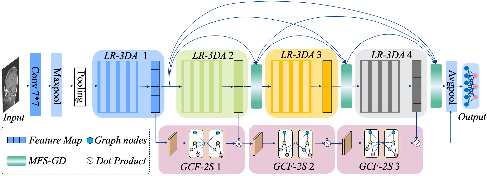

# Efficient brain MRI Tumor Diagnosis by Fusing Tensor Residual Group and Superpixel Map Features

## Overview

<div style="text-align:center">
</div>
Brain tumors present a significant threat to human life and health. However, current deep learning models for brain MRI diagnosis often struggle with insufficient feature representation and limited balancing capabilities, which impairs diagnostic accuracy. To address these issues, we propose the Efficient Brain MRI Tumor Diagnosis Networks by Fusing Tensor Residual Attention and Superpixel Map Features (BTNet-TS). First, BTNet-TS incorporates Lightweight Residual blocks Fused with 3D tensor Attention (LR-3DA), which utilize 3D tensors to capture multidimensional semantic features of brain MRI lesions. Then, a Multi-scale Feature Fusion Strategy based on Group DenseNet (MFS-GD) is introduced to fuse underlying fine-grained features with deep semantic information. Finally, a Graph Convolutional Feature extraction method based on Superpixel Segmentation (GCF-2S) is developed to extract and analyze lesion-local correlation features. The experimental results demonstrate that the method presented in this paper achieves the best diagnostic performance across three brain MRI tumor datasets, with improvements of 2.68% and 2.63% in Acc and F1 scores compared to leading models, including the lightweight MobileNet and the latest RDNet, reaching a maximum accuracy of 98.28%. Additionally, BTNet-TS balances stability and efficiency more effectively, further demonstrating its efficacy in brain MRI tumor diagnosis. The code and pre-trained model are available at https://github.com/DL-Clas/Tumors_Clas.git.

# Construction

    git clone https://github.com/DL-Clas/Tumors_Clas.git


## Testing with ETD-TGSF

Copy and paste your images into data/ or data2/ folder, and:

    python predict.py

## Testing with ETD-TGSF

    python eval.py
    
## Training with ETD-TGSF
    
    python main.py

Check the configurations of the training in train.py


## Brain Tumor Dataset dataset (Clas-3)

Here the [link](https://www.scidb.cn/en/detail?dataSetId=faa44e0a12da4c11aeee91cc3c8ac11e#detail_start)

## Citation

```
Jun Cheng. Brain Tumor Dataset[DS/OL]. V1. Science Data Bank, 2022[2024-08-24]. 
https://cstr.cn/31253.11.sciencedb.06290. CSTR:31253.11.sciencedb.06290.
```

## Brain Tumor MRI Dataset (Clas-4)

Here the [link](https://www.kaggle.com/datasets/masoudnickparvar/brain-tumor-mri-dataset)

## Citation

```
“Brain Tumor MRI Dataset.” Accessed: Aug. 24, 2024. [Online]. 
Available: https://www.kaggle.com/datasets/masoudnickparvar/brain-tumor-mri-dataset
```
## Brain Tumor MRI Images 44 Classes (Clas-44)

Here the [link](https://www.kaggle.com/datasets/fernando2rad/brain-tumor-mri-images-44c?select=Astrocitoma+T1)

## Citation

```
“Brain Tumor MRI Images 44 Classes.” Accessed: Aug. 24, 2024. [Online]. 
Available: https://www.kaggle.com/datasets/fernando2rad/brain-tumor-mri-images-44c
```
